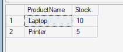

# Inventory Management System (SQL Practice)

## Overview
A beginner SQL project to track product stock, suppliers, and sales.

## Features
- Tables for products, suppliers, and transactions.
- Queries to check low-stock items.
- Reports using `JOIN` statements to connect tables.

## Skills Practiced
- Relational database design
- Using JOIN for multi-table queries
- Conditional queries for stock monitoring

## Example Query Result

